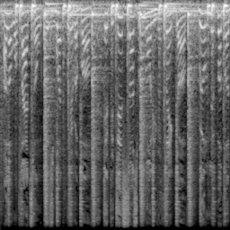

# audio-diffusion [](https://colab.research.google.com/github/teticio/audio-diffusion/blob/master/notebooks/gradio_app.ipynb)

### Apply [Denoising Diffusion Probabilistic Models](https://arxiv.org/abs/2006.11239) using the new Hugging Face [diffusers](https://github.com/huggingface/diffusers) package to synthesize music instead of images.

---

**UPDATES**:

15/10/2022
Added latent audio diffusion (see below).

4/10/2022
It is now possible to mask parts of the input audio during generation which means you can stitch several samples together (think "out-painting").

27/9/2022
You can now generate an audio based on a previous one. You can use this to generate variations of the same audio or even to "remix" a track (via a sort of "style transfer"). You can find examples of how to do this in the [`test_model.ipynb`](https://colab.research.google.com/github/teticio/audio-diffusion/blob/master/notebooks/test_model.ipynb) notebook.

---



---

Audio can be represented as images by transforming to a [mel spectrogram](https://en.wikipedia.org/wiki/Mel-frequency_cepstrum), such as the one shown above. The class `Mel` in `mel.py` can convert a slice of audio into a mel spectrogram of `x_res` x `y_res` and vice versa. The higher the resolution, the less audio information will be lost. You can see how this works in the [`test_mel.ipynb`](https://github.com/teticio/audio-diffusion/blob/main/notebooks/test_mel.ipynb) notebook.

A DDPM model is trained on a set of mel spectrograms that have been generated from a directory of audio files. It is then used to synthesize similar mel spectrograms, which are then converted back into audio.

You can play around with some pretrained models on [Google Colab](https://colab.research.google.com/github/teticio/audio-diffusion/blob/master/notebooks/test_model.ipynb) or [Hugging Face spaces](https://huggingface.co/spaces/teticio/audio-diffusion). Check out some automatically generated loops [here](https://soundcloud.com/teticio2/sets/audio-diffusion-loops).


| Model | Dataset | Description |
|-------|---------|-------------|
| [teticio/audio-diffusion-256](https://huggingface.co/teticio/audio-diffusion-256) | [teticio/audio-diffusion-256](https://huggingface.co/datasets/teticio/audio-diffusion-256) | My "liked" Spotify playlist |
| [teticio/audio-diffusion-breaks-256](https://huggingface.co/teticio/audio-diffusion-breaks-256) | [teticio/audio-diffusion-breaks-256](https://huggingface.co/datasets/teticio/audio-diffusion-breaks-256) | Samples that have been used in music, sourced from [WhoSampled](https://whosampled.com) and [YouTube](https://youtube.com) |
| [teticio/audio-diffusion-instrumental-hiphop-256](https://huggingface.co/teticio/audio-diffusion-instrumental-hiphop-256) | [teticio/audio-diffusion-instrumental-hiphop-256](https://huggingface.co/datasets/teticio/audio-diffusion-instrumental-hiphop-256) | Instrumental Hip Hop music |

---

## Generate Mel spectrogram dataset from directory of audio files
#### Install
```bash
pip install .
```

#### Training can be run with Mel spectrograms of resolution 64x64 on a single commercial grade GPU (e.g. RTX 2080 Ti). The `hop_length` should be set to 1024 for better results.

```bash
python scripts/audio_to_images.py \
  --resolution 64 \
  --hop_length 1024 \
  --input_dir path-to-audio-files \
  --output_dir path-to-output-data
```

#### Generate dataset of 256x256 Mel spectrograms and push to hub (you will need to be authenticated with `huggingface-cli login`).
```bash
python scripts/audio_to_images.py \
  --resolution 256 \
  --input_dir path-to-audio-files \
  --output_dir data/audio-diffusion-256 \
  --push_to_hub teticio/audio-diffusion-256
```

## Train model
#### Run training on local machine.
```bash
accelerate launch --config_file config/accelerate_local.yaml \
  scripts/train_unconditional.py \
  --dataset_name data/audio-diffusion-64 \
  --resolution 64 \
  --hop_length 1024 \
  --output_dir models/ddpm-ema-audio-64 \
  --train_batch_size 16 \
  --num_epochs 100 \
  --gradient_accumulation_steps 1 \
  --learning_rate 1e-4 \
  --lr_warmup_steps 500 \
  --mixed_precision no
```

#### Run training on local machine with `batch_size` of 2 and `gradient_accumulation_steps` 8 to compensate, so that 256x256 resolution model fits on commercial grade GPU and push to hub.
```bash
accelerate launch --config_file config/accelerate_local.yaml \
  scripts/train_unconditional.py \
  --dataset_name teticio/audio-diffusion-256 \
  --resolution 256 \
  --output_dir models/audio-diffusion-256 \
  --num_epochs 100 \
  --train_batch_size 2 \
  --eval_batch_size 2 \
  --gradient_accumulation_steps 8 \
  --learning_rate 1e-4 \
  --lr_warmup_steps 500 \
  --mixed_precision no \
  --push_to_hub True \
  --hub_model_id audio-diffusion-256 \
  --hub_token $(cat $HOME/.huggingface/token)
```

#### Run training on SageMaker.
```bash
accelerate launch --config_file config/accelerate_sagemaker.yaml \
  scripts/train_unconditional.py \
  --dataset_name teticio/audio-diffusion-256 \
  --resolution 256 \
  --output_dir models/ddpm-ema-audio-256 \
  --train_batch_size 16 \
  --num_epochs 100 \
  --gradient_accumulation_steps 1 \
  --learning_rate 1e-4 \
  --lr_warmup_steps 500 \
  --mixed_precision no
```
## Latent Audio Diffusion
Rather than denoising images directly, it is interesting to work in the "latent space" after first encoding images using an autoencoder. This has a number of advantages. Firstly, the information in the images is compressed into a latent space of a much lower dimension, so it is much faster to train denoising diffusion models and run inference with them. Secondly, as the latent space is really a array (tensor) of guassian variables with a particular mean, the decoder is invariant to guassian noise. And thirdly, similar images tend to be clustered together and interpolating between two images in latent space can produce meaningful combinations.

At the time of writing, the Hugging Face `diffusers` library is geared towards inference and lacking in training functionality, rather like its cousin `transformers` in the early days of development. In order to train a VAE (Variational Autoencoder), I use the [stable-diffusion](https://github.com/CompVis/stable-diffusion) repo from CompVis and convert the checkpoints to `diffusers` format. Note that it uses a perceptual loss function for images; it would be nice to try a perceptual *audio* loss function.

#### Train an autoencoder.
```bash
python scripts/train_vae.py \
  --dataset_name teticio/audio-diffusion-256 \
  --batch_size 2 \
  --gradient_accumulation_steps 12
```

#### Train latent diffusion model.
```bash
accelerate launch ...
  --vae models/autoencoder-kl 
```
